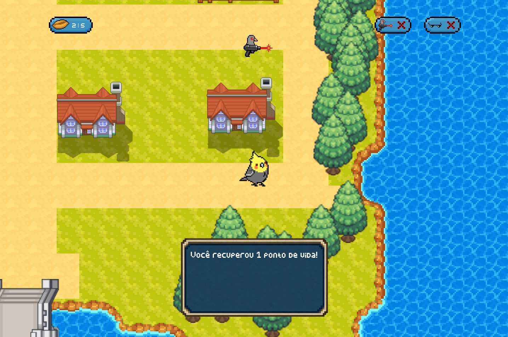

# Juliano_Bizarre_Adventure

## Membros da Equipe
  * Eduarda Rodrigues (erms2@cin.ufpe.br)
  * Felipe Leite (fsl8@cin.ufpe.br)
  * Isaac Teixeira (imts2@cin.ufpe.br)
  * Isabelle Tenório (itvb@cin.ufpe.br)
  * Marcelo Barreiros (mhab@cin.ufpe.br)

## Descrição Breve
  Nosso jogo é protagonizado por Juliano, uma calopsita com um passado triste, e enfrentará uma árdua jornada em busca de um lar.
  (Baseado em fatos reais) 
  
## Imagens do Jogo

## Arquitetura do Projeto:
  * - Juliano_Bizzare_Adventure/ # Pasta do Repositório que engloba todo o nosso projeto.
  *   -  codigo/ # Pasta direcionada a programação do jogo, todos os arquivos .py e afins são organizados nessa pasta.
          -  audios/  
          -  sprites/
          -  tela_final_feliz/
          -  tela_gameover/
          -  tela_inicial/
          -  coletaveis.py # Contem as classes dos coletáveis;
          -  configuracoes.py # Arquivo contendo as configurações que serão importadas na classe Jogo
          -  entidades.py # Arquivo contendo todos as classes dos personagens do jogo;
          -  logica_batalha.py # Responsável por realizar a lógica das batalhas; 
          -  logica_jogo.py # Responsável por organizar todo o funcionamento do jogo, importando entidades, configurações, coletaveis e demais arquivos necessários;
          -  main.py # Responsável unicamente por instanciar a classe Jogo do arquivo logica_jogo.py e inicializar o game;
          -  personagens.py
      -  graficos/ # Pasta que contem os arquivos de mídia utilizados, como as sprites dos personagens, modelo do mapa feito no tiled, fontes, etc.
          -  background_batalha/
          -  fontes/
          -  mapa/
          -  objetos/
          -  personagens/
          -  score/
       
        Codigos organizados em arquivos separados, de modo a organizar a leitura. Foi aplicado conceito de modularização, onde cada arquivo era responsável por uma determinada funcionalidade dentro da lógica aplicada no jogo.

## Ferramentas Utilizadas:

  * Utilizamos a biblioteca pygame-ce ao invés do pygame, pois o pygame padrão é um pouco mais limitado em relação ao que usamos, e pela facilidade de implementar sprites;
  * Usamos o Tiled para fazer o mapa do jogo em formato .tmx;
  * Piskel e Paint para fazer as sprites em forma de pixelart;
  * Visual Studio Code para programar;
  * Whatsapp como canal de comunicação;
  * Trello para organização e divisão de tarefas;
  * Discord para nos reunirmos e alinharmos nossas ideias;
  * Youtube como uma fonte de sons usados no jogo.

## Divisão de trabalhos:
  * Eduarda Rodrigues- Implementou as telas e criou a base do sistema de combate, e slide.
  * Felipe Leite- Criação do mapa usando o tiled e seus objetos, realizou ajustes gráficos nas interações durante as batalhas.
  * Isaac Teixeira- Colisões com npcs, com coletáveis, e com o cenário, e relatório.
  * Isabelle Tenório- Criou as sprites dos personagens e dos coletáveis, das telas do final e do game over, as classes dos coletáveis e os scores (contadores) dos coletáveis.
  * Marcelo Barreiros- Implementou os gráficos no jogo e criou as classes e funções usadas.
  * Apesar dessa divisão de trabalhos, nós ajudamos uns aos outros quando algum de nós encontrava alguma dificuldade 

## Conceitos apresentados durante a disciplina que utilizamos:
  * Laços de repetição para rodar o jogo, carregar os objetos no mapa e verificar se ocorreram colisões;
  * Condicionais;
  * Matrizes para movimentação e para carregar colisões;
  * Listas para armazenar os ataques que podem ser utilizados;
  * Classes e funções para fazer o código orientado à objeto;
  * Tuplas para algumas funções da biblioteca pygame-ce;
  * Git e GitHub para controle de versão.

## Desafios e erros enfrentados e lições aprendidas
  * "Qual foi o maior erro cometido durante o projeto? Como vocês lidaram com ele?”:
    Nosso maior erro foi subestimar o processo de criação do mapa, o que acabou nos atrasando um pouco, então priozamos o estudo sobre ele.
  * “Qual foi o maior desafio enfrentado durante o projeto? Como vocês lidaram com ele?”:
    O maior desafio que enfrentamos foi com certeza o prazo para terminar o projeto, isso impactou fortemente nosso planejamento e nos forçou muitas vezes a abrir mão de implementar mecânicas mais complexas.
  * Lições aprendidas:
    * A importância da comunicação entre a equipe: A comunicação entre nós foi fundamental para conseguirmos terminar o projeto, pois nos garantiu um alinhamento de visão, o que nos evitou duplicamento de tarefas e uma maior organização.
    * A importância de um bom planejamento: Subestimar algumas tarefas durante o projeto nos atrasou bastante, e esse atraso nos forçou a simplificar algumas coisas no projeto. Isso evidenciou a importância de um bom planejamento que leve em conta possíveis imprevistos.
